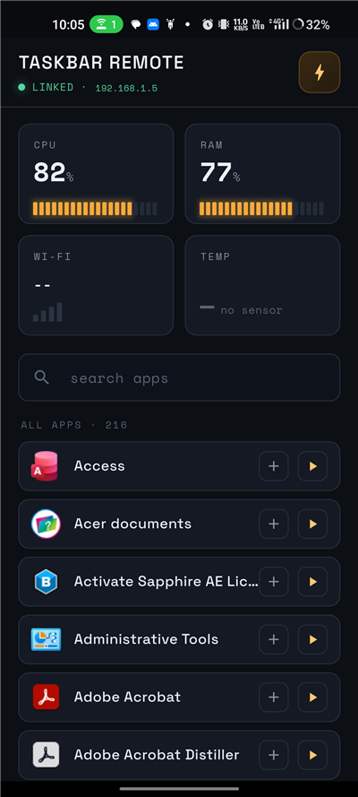
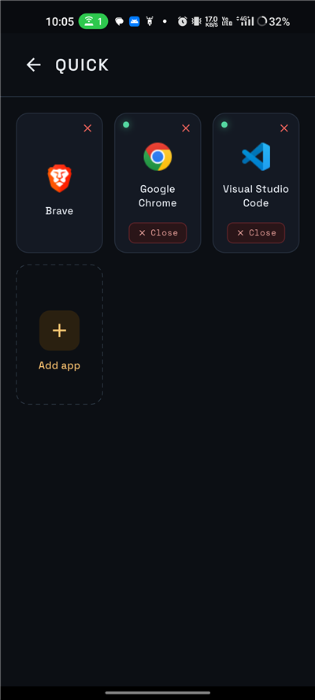
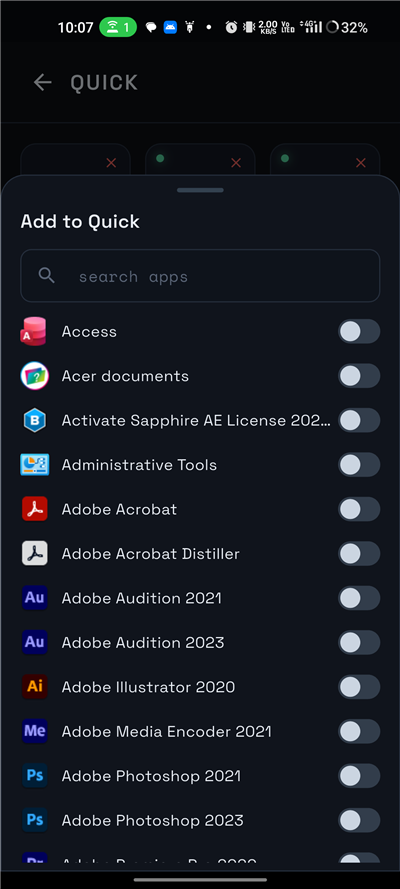
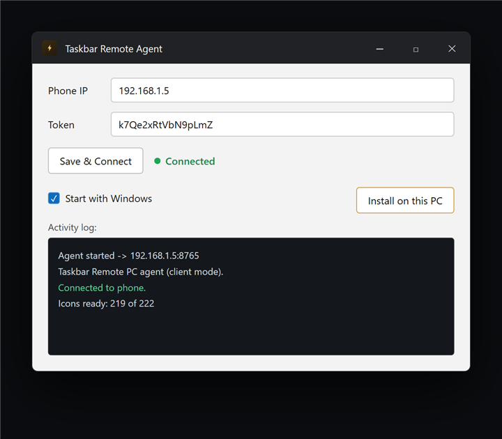

# ⚡ Taskbar Remote

**Control your Windows PC from your Android phone — over your own Wi-Fi.**

See your PC's live stats and **open, switch to, or close any app on it** straight from your phone. No internet, no account, no cloud — your phone and PC just talk to each other on your local network.

<table>
  <tr>
    <td align="center" width="33%"><br/><sub><b>Live stats + your apps</b></sub></td>
    <td align="center" width="33%"><br/><sub><b>Quick — pinned apps</b></sub></td>
    <td align="center" width="33%"><br/><sub><b>Add apps to Quick</b></sub></td>
  </tr>
</table>

The small companion app that runs on your PC:

<p align="center"></p>

---

## What you can do

- 📊 **See your PC at a glance** — live CPU, RAM, and Wi-Fi.
- 🚀 **Open any PC app from your phone** — just search and tap.
- 🔁 **Already open? It switches to it** — taps bring the window to the front instead of opening a second copy.
- ❌ **Close a PC app from your phone** — running apps show a green dot and a Close button.
- ⭐ **Quick page** — pin your favourite apps for one-tap access.
- 🎨 **Real app icons** pulled straight from your PC.

---

## How to set it up

It takes about a minute, and you only do it once.

1. **Install the phone app** and open it. It shows a **Phone IP** and a **Token**.
2. **On your PC, run Taskbar Remote.** Type in that IP and token, then click **Connect**.
   *(Optional: click **Install on this PC** so it starts automatically with Windows.)*
3. That's it — your phone now shows your PC and all its apps. ✅

> **Both devices just need to be on the same Wi-Fi** — your home Wi-Fi works, and so does your phone's own hotspot.

---

## How it works

Your phone and PC talk **directly to each other over your local Wi-Fi** — nothing goes through the internet or any server.

A tiny program (the "agent") runs on your PC. It reads basic system info and opens/closes apps when you tap them on your phone. The phone shows everything and sends your commands. The PC connects out to the phone, which is what lets it work even over your phone's hotspot.

---

## Privacy & security

- 🔒 **Local only** — it works on your network; nothing leaves it and nothing is uploaded.
- 🔑 **Token-protected** — a random token (like a password) is required to connect, so a random device can't control your PC.
- The PC app only ever opens your normal Start Menu apps and reads system stats.

Use it on your own Wi-Fi or hotspot. (Like most LAN tools, avoid untrusted public Wi-Fi.)

---

## For developers — build from source

<details>
<summary>Build steps</summary>

**Needs:** [Flutter](https://flutter.dev) 3.44+, the Android SDK, a JDK 17–21 (the one in Android Studio is fine), and Windows for the PC side.

**Phone app (APK):**
```bash
flutter pub get
flutter build apk --release        # -> build/app/outputs/flutter-apk/app-release.apk
```

**PC agent (standalone .exe):**
```bash
dart build cli                     # -> build/cli/windows_x64/bundle/bin/pc_agent.exe
```

**Windows desktop app** (single self-installing .exe — embeds the agent), built with the built-in .NET Framework compiler:
```bat
csc /target:winexe /out:TaskbarRemote.exe /win32icon:windows-agent\app.ico ^
    /resource:build\taskbar-agent.exe,agent ^
    /reference:System.dll /reference:System.Drawing.dll /reference:System.Windows.Forms.dll ^
    windows-agent\TaskbarRemote.cs
```

| Path | What it is |
|---|---|
| `lib/main.dart` | The Android app (Flutter) |
| `bin/pc_agent.dart` | The PC agent (Dart) |
| `windows-agent/TaskbarRemote.cs` | The Windows desktop app (C#/WinForms) |

</details>

---

Built with Flutter, Dart, and a little C#. Fonts: Space Grotesk + Space Mono (SIL OFL).

## License

[MIT](LICENSE) — free to use, change, and share.
